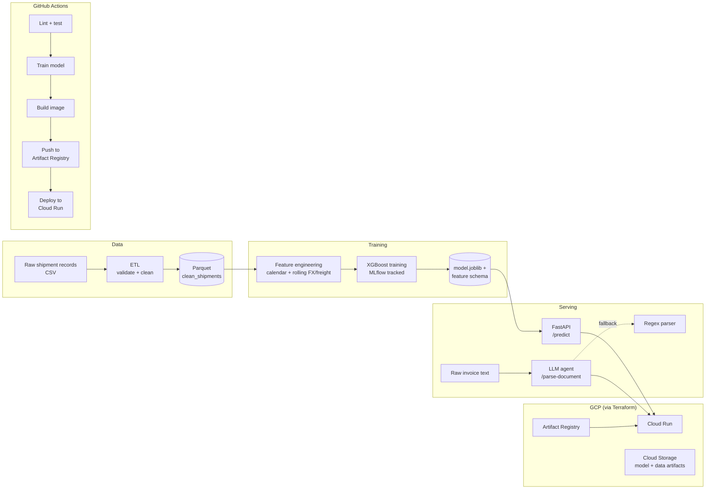

# TradeFlow-ML

End-to-end MLOps pipeline that predicts **landed cost** for India → Poland
FCL shipments (Mundra/Nhava Sheva → Gdynia/Gdansk), and uses an LLM agent to
extract structured fields from raw trade documents (commercial invoices,
packing lists).

The model and data are grounded in a real trade lane (organic spices,
psyllium husk, lentils, hotel textiles) rather than a generic Kaggle dataset
— the goal is to demonstrate the full production ML lifecycle: data
pipeline → feature engineering → experiment-tracked training → containerized
serving → CI/CD → cloud deployment via IaC.

## Architecture



## What each piece does

| Layer | Location | Purpose |
|---|---|---|
| Data generation | `data/generate_synthetic_data.py` | Synthetic shipment records shaped like real freight/FX/customs data. Swap for a real warehouse/CSV source without touching downstream code. |
| ETL | `src/pipeline/etl.py` | Load, validate, and quality-check raw records; writes a canonical Parquet dataset. Includes explicit data quality tests (nulls, range checks, duplicate rate). |
| Feature engineering | `src/pipeline/features.py` | Calendar features, rolling FX/freight windows, one-hot encoding with frozen category schema (so training and inference never diverge in shape). |
| Training | `src/models/train.py` | XGBoost regressor, MLflow experiment tracking (params, metrics, model artifact). |
| Inference | `src/models/predict.py` | Loads the frozen model + schema; used by the API. Kept dependency-light (no MLflow/sklearn training deps) for a smaller serving image. |
| Agentic parsing | `src/agent/document_parser.py` | Calls Claude to extract structured fields (HS code, Incoterm, value, quantity) from free-text trade documents; degrades to a regex parser if no API key is set, so it's testable offline/in CI. |
| API | `src/api/main.py` | FastAPI service exposing `/predict`, `/parse-document`, `/health`. |
| Tests | `tests/` | Unit tests for feature engineering and the parsing agent, plus an API integration test that trains a small model and hits the endpoints. |
| CI/CD | `.github/workflows/ci-cd.yml` | Lint (ruff) → test (pytest) → train → build Docker image → push to Artifact Registry → deploy to Cloud Run → smoke test. |
| IaC | `terraform/` | Artifact Registry repo, Cloud Storage bucket for artifacts, service account, Cloud Run service — all provisioned declaratively. |

## Running locally

```bash
python -m venv .venv && source .venv/bin/activate
pip install -r requirements.txt

# 1. Generate data and run the pipeline
python -m data.generate_synthetic_data
python -m src.pipeline.etl

# 2. Train (logs to ./mlruns — run `mlflow ui` to inspect)
python -m src.models.train

# 3. Serve
uvicorn src.api.main:app --reload

# 4. Test
pytest -v
```

Example prediction request:

```bash
curl -X POST http://localhost:8000/predict \
  -H "Content-Type: application/json" \
  -d '{
    "ship_date": "2026-07-01", "origin_port": "Mundra", "dest_port": "Gdynia",
    "commodity": "psyllium_husk", "container_type": "40ft_FCL",
    "goods_value_usd": 26000, "freight_rate_usd": 2100, "fuel_index": 110,
    "fx_usd_pln": 3.95, "fx_usd_inr": 83.1, "transit_days": 28,
    "customs_duty_rate": 0.03, "insurance_usd": 104, "duty_usd": 780
  }'
```

## Deploying to GCP

Requires a GCP project with billing enabled and the Cloud Run, Artifact
Registry, and IAM APIs turned on.

```bash
cd terraform
terraform init
terraform apply -var="project_id=YOUR_PROJECT_ID"
```

CI/CD picks up from there on every push to `main` — it authenticates via
Workload Identity Federation (no long-lived JSON keys), builds the image,
pushes it, and deploys to the Cloud Run service Terraform created.

Required GitHub Actions secrets: `GCP_PROJECT_ID`,
`GCP_WORKLOAD_IDENTITY_PROVIDER`, `GCP_SERVICE_ACCOUNT`.

## Design decisions worth calling out

- **Frozen category schema** (`categories.json`): one-hot encoding is fit once
  at training time and reused at inference, so a new commodity/route showing
  up in production can't silently produce a differently-shaped feature
  matrix and crash or mis-predict.
- **Agent with a fallback, not a hard dependency**: `/parse-document` works
  with or without an `ANTHROPIC_API_KEY`, which keeps CI deterministic and
  avoids paying for API calls on every test run.
- **Thin API layer**: `src/api/main.py` has no business logic — it's a
  routing/validation layer over `src/models` and `src/agent`, so those
  modules are independently testable and reusable (e.g. from a batch job).
- **Separate train-time vs serve-time dependencies**: `predict.py` avoids
  importing `mlflow`/training-only libraries, keeping the production
  container smaller and its attack surface narrower.

## Possible extensions

- Swap the synthetic data source for a real BigQuery/Iceberg table.
- Add a Vertex AI Pipelines version of the training DAG for scheduled
  retraining.
- Add drift detection (e.g. compare live feature distributions against the
  training set) and wire it to a Cloud Monitoring alert.
- Add authentication to the Cloud Run service and drop the public-invoker
  IAM binding in `terraform/main.tf`.
