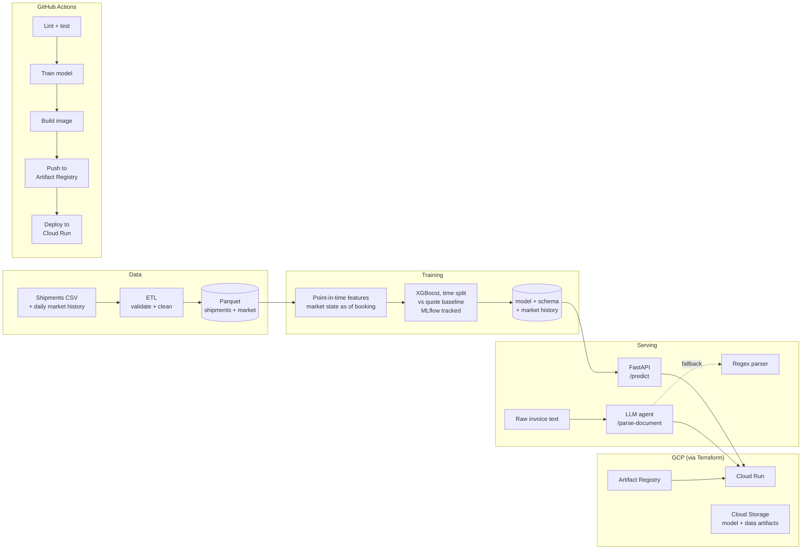

# TradeFlow-ML

End-to-end MLOps pipeline that forecasts **landed cost at booking time** for
India → Poland FCL shipments (Mundra/Nhava Sheva/Chennai → Gdynia/Gdansk), and
uses an LLM to extract structured fields from raw trade documents (commercial
invoices, packing lists).

## The problem

When a trader books a container, they know the goods, the route and the
forwarder's freight quote. The landed cost is only settled weeks later, and it
rarely matches the quote:

- carriers pass freight market increases between booking and departure on as
  rate increases (and pass decreases on only in part)
- the bunker (fuel) surcharge is set at departure
- delays beyond the free days cost demurrage, and delays cluster in peak
  season and during supply disruptions
- customs clears at the USD/PLN rate on arrival day, not booking day

The model forecasts the landed cost using only what is known on booking day,
and is judged against the estimate a trader would work out by hand from the
quote.

The model and data are grounded in a real trade lane (organic spices,
psyllium husk, lentils, hotel textiles) rather than a generic Kaggle dataset
— the goal is to demonstrate the full production ML lifecycle: data
pipeline → feature engineering → experiment-tracked training → containerized
serving → CI/CD → cloud deployment via IaC.

## Architecture



## What each piece does

| Layer | Location | Purpose |
|---|---|---|
| Data generation | `data/generate_synthetic_data.py` | Synthetic daily market history (freight index with seasonality and disruption regimes, USD/PLN, fuel) and shipments whose landed cost is realized at arrival. Swap for real records and a market data feed without touching downstream code. |
| Cost rules | `src/pipeline/costs.py` | Insurance, CIF-based customs duty, bunker surcharge, demurrage and terminal charges, shared by the generator and the baseline. |
| ETL | `src/pipeline/etl.py` | Loads and validates both datasets: required columns, value ranges, arrival after booking, and a gap-free daily market series. |
| Feature engineering | `src/pipeline/features.py` | Point-in-time features: shipment facts plus market state *as of* the booking date (freight momentum, volatility, level vs its 6-month mean). Rows are independent, so training batches and single API requests get identical features. |
| Training | `src/models/train.py` | Time-based split with a label-availability cutoff, XGBoost on the log ratio of realized cost to the quote estimate, two baselines, MLflow tracking. |
| Inference | `src/models/predict.py` | Loads the model directory (model, schema, market history) and forecasts; rejects unknown categories and dates the market data cannot cover. |
| Document parsing | `src/agent/document_parser.py` | Calls Claude with a forced tool call, so the answer is schema-shaped data; validates the fields, logs every fallback with its reason, and falls back to a regex parser without an API key. |
| API | `src/api/main.py` | FastAPI service exposing `/predict`, `/parse-document`, `/health`. |
| Tests | `tests/` | Leakage tests (no look-ahead, outcome columns ignored, training labels known by the cutoff), batch vs single-request parity, a check that the model beats both baselines, parser failure paths, and API tests. |
| CI/CD | `.github/workflows/ci-cd.yml` | Lint (ruff) → test (pytest) → train → build Docker image → push to Artifact Registry → deploy to Cloud Run → smoke test. |
| IaC | `terraform/` | Artifact Registry repo, Cloud Storage bucket for artifacts, service account, Cloud Run service — all provisioned declaratively. |

## Running locally

```bash
python -m venv .venv && source .venv/bin/activate
pip install -r requirements.txt

# 1. Generate shipments + market history and run the pipeline
python -m data.generate_synthetic_data
python -m src.pipeline.etl

# 2. Train (logs to ./mlruns — run `mlflow ui` to inspect)
python -m src.models.train

# 3. Serve
uvicorn src.api.main:app --reload

# 4. Test
pytest -v
```

Example forecast request, with only booking-day information:

```bash
curl -X POST http://localhost:8000/predict \
  -H "Content-Type: application/json" \
  -d '{
    "booking_date": "2026-06-20", "lead_time_days": 14,
    "origin_port": "Mundra", "dest_port": "Gdynia",
    "commodity": "psyllium_husk", "container_type": "40ft_FCL",
    "goods_value_usd": 48000, "customs_duty_rate": 0.03,
    "planned_transit_days": 28, "freight_quote_usd": 4100
  }'
```

The response gives the forecast, the quote-based estimate for comparison, and
the date of the market data used. FX and fuel come from the market history
saved with the model; a booking more than 7 days past its end is refused
until the market data is refreshed.

## Results

On bookings made after the training cutoff (480 shipments, never seen in
training), from `models/metrics.json`:

| Estimate | MAE | MAPE | 90th percentile error |
|---|---|---|---|
| Quote-based estimate (what a trader calculates at booking) | 6,009 PLN | 3.5% | 14,003 PLN |
| Same, plus the average historical overrun | 5,677 PLN | 3.3% | 11,996 PLN |
| **Model** | **3,805 PLN** | **2.2%** | **8,357 PLN** |

The model cuts the error by a third compared with the bias-corrected quote.
Most of the gain comes from anticipating freight rate increases (market
momentum, disruption regimes, peak season) and delay costs. Roughly a quarter
of the remaining error is the USD/PLN move between booking and customs
clearance, which no model can forecast reliably; the business answer to that
is an FX forward, not a better model.

These numbers come from synthetic data with known structure, so they show the
pipeline works as intended, not how well it would do on a real book of
shipments.

## Deploying to GCP

Requires a GCP project with billing enabled and the Cloud Run, Artifact
Registry, and IAM APIs turned on.

```bash
cd terraform
terraform init
terraform apply -var="project_id=YOUR_PROJECT_ID"
```

CI/CD picks up from there on every push to `main` — it authenticates via
Workload Identity Federation (no long-lived JSON keys), builds the image,
pushes it, and deploys to the Cloud Run service Terraform created.

Required GitHub Actions secrets: `GCP_PROJECT_ID`,
`GCP_WORKLOAD_IDENTITY_PROVIDER`, `GCP_SERVICE_ACCOUNT`.

## Design decisions worth calling out

- **Point-in-time correctness**: every feature is computed from data available
  on the booking date. The tests shock market prices after a date and check that
  the features for that date do not change, and scramble the outcome columns
  and check that the features do not change either.
- **Label-availability cutoff**: a shipment's landed cost is only known after it
  clears customs. Training uses only shipments that had arrived by the cutoff;
  ones still at sea are left out of both sets.
- **Predict the deviation, not the level**: the model learns the log ratio of
  realized cost to the quote estimate. The arithmetic stays exact, and tree
  models do not have to extrapolate price levels that drift upward over time.
- **Always against a baseline**: a model that cannot beat a hand calculation
  is not worth deploying, so every training run reports both baselines.
- **Frozen category schema** (`categories.json`): one-hot encoding is fit once
  at training time and reused at inference, so a new commodity/route showing
  up in production can't silently produce a differently-shaped feature
  matrix and crash or mis-predict. Unknown values are rejected with a 422.
- **Agent with a fallback, not a hard dependency**: `/parse-document` works
  with or without an `ANTHROPIC_API_KEY`, which keeps CI deterministic and
  avoids paying for API calls on every test run.
- **Thin API layer**: `src/api/main.py` has no business logic — it's a
  routing/validation layer over `src/models` and `src/agent`, so those
  modules are independently testable and reusable (e.g. from a batch job).
- **Separate train-time vs serve-time code**: `predict.py` does not import
  `mlflow` or training code. The image still installs the full
  `requirements.txt`; a separate serving requirements file would be the next
  step to shrink it.

## Possible extensions

- Swap the synthetic data for real shipment records and a daily market feed
  (a freight index such as Drewry WCI, NBP exchange rates).
- Prediction intervals (quantile regression), since a range is more useful
  than a point estimate for pricing a contract.
- Add a Vertex AI Pipelines version of the training DAG for scheduled
  retraining.
- Add drift detection (e.g. compare live feature distributions against the
  training set) and wire it to a Cloud Monitoring alert.
- Add authentication to the Cloud Run service and drop the public-invoker
  IAM binding in `terraform/main.tf`.
